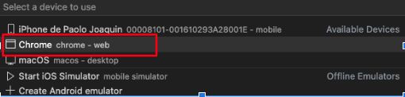

# Flutter Web Layout

A layout for Starting developing on a Flutter Web App project.

## Getting Started

This project is a starting point for a Flutter application.

```sh
flutter pub get
```
#### Iniciar proyecto desde vscode:
1. seleccionar dispositivo a Chrome
```sh
// windows
ctrl + ⬆️ + p

// mac
cmd + ⬆️ + p
```

2. Comando para ejecutar 
```sh
F5
```
## Recursos:

- Escribe tu primera app en la web [Get Started Flutter Web](https://docs.flutter.dev/get-started/codelab-web)

- LayoutBuilder widget(Para hacer responsive): [Widget of the week: LayoutBuilder](https://www.youtube.com/watch?v=IYDVcriKjsw)

- Package SEO Friendly: [Package para darle semantica HTML](https://pub.dev/packages/seo_renderer)


## Presentacion
- (Diapositivas: Presentacion Flutter Web)[https://docs.google.com/presentation/d/1WRVkjeY1KL6y6ORbOItFzQf1EwriVBxL76dYneNSgyo/edit?usp=sharing]


### Librerias(Packages utilizados).
- [Fluro: para controlar rutas dinamicas](https://pub.dev/packages/fluro)
- [Get It: path provider](https://pub.dev/packages/get_it)
- [Http: Peticiones(GET, POST, UPDATE, DELETE) desde cualquier url ](https://pub.dev/packages/http)
- [Http Parser](https://pub.dev/packages/http_parser)


@paolojoaquinp
